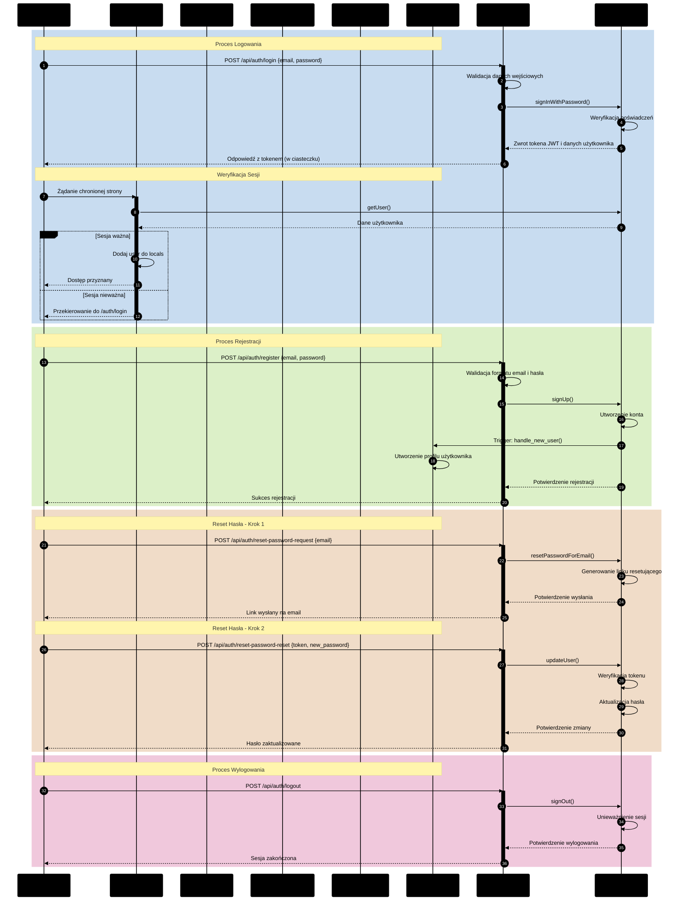

```mermaid
%%{init: {'theme': 'base', 'themeVariables': { 'primaryColor': '#000000', 'primaryTextColor': '#000000', 'primaryBorderColor': '#000000', 'lineColor': '#000000', 'secondaryColor': '#000000', 'tertiaryColor': '#000000' }}}%%
sequenceDiagram
    autonumber
    
    participant Przeglądarka
    participant Middleware
    participant "Astro API" as API
    participant "Supabase Auth" as Auth
    participant "Baza Danych" as DB

    %% Logowanie
    rect rgb(200, 220, 240)
        Note over Przeglądarka,DB: Proces Logowania
        Przeglądarka->>API: POST /api/auth/login {email, password}
        activate API
        API->>API: Walidacja danych wejściowych
        API->>Auth: signInWithPassword()
        Auth->>Auth: Weryfikacja poświadczeń
        Auth-->>API: Zwrot tokena JWT i danych użytkownika
        API-->>Przeglądarka: Odpowiedź z tokenem (w ciasteczku)
        deactivate API
        
        Note over Przeglądarka,DB: Weryfikacja Sesji
        Przeglądarka->>Middleware: Żądanie chronionej strony
        activate Middleware
        Middleware->>Auth: getUser()
        Auth-->>Middleware: Dane użytkownika
        alt Sesja ważna
            Middleware->>Middleware: Dodaj user do locals
            Middleware-->>Przeglądarka: Dostęp przyznany
        else Sesja nieważna
            Middleware-->>Przeglądarka: Przekierowanie do /auth/login
        end
        deactivate Middleware
    end

    %% Rejestracja
    rect rgb(220, 240, 200)
        Note over Przeglądarka,DB: Proces Rejestracji
        Przeglądarka->>API: POST /api/auth/register {email, password}
        activate API
        API->>API: Walidacja formatu email i hasła
        API->>Auth: signUp()
        Auth->>Auth: Utworzenie konta
        Auth->>DB: Trigger: handle_new_user()
        DB->>DB: Utworzenie profilu użytkownika
        Auth-->>API: Potwierdzenie rejestracji
        API-->>Przeglądarka: Sukces rejestracji
        deactivate API
    end

    %% Reset Hasła
    rect rgb(240, 220, 200)
        Note over Przeglądarka,DB: Reset Hasła - Krok 1
        Przeglądarka->>API: POST /api/auth/reset-password-request {email}
        activate API
        API->>Auth: resetPasswordForEmail()
        Auth->>Auth: Generowanie linku resetującego
        Auth-->>API: Potwierdzenie wysłania
        API-->>Przeglądarka: Link wysłany na email
        deactivate API

        Note over Przeglądarka,DB: Reset Hasła - Krok 2
        Przeglądarka->>API: POST /api/auth/reset-password-reset {token, new_password}
        activate API
        API->>Auth: updateUser()
        Auth->>Auth: Weryfikacja tokenu
        Auth->>Auth: Aktualizacja hasła
        Auth-->>API: Potwierdzenie zmiany
        API-->>Przeglądarka: Hasło zaktualizowane
        deactivate API
    end

    %% Wylogowanie
    rect rgb(240, 200, 220)
        Note over Przeglądarka,DB: Proces Wylogowania
        Przeglądarka->>API: POST /api/auth/logout
        activate API
        API->>Auth: signOut()
        Auth->>Auth: Unieważnienie sesji
        Auth-->>API: Potwierdzenie wylogowania
        API-->>Przeglądarka: Sesja zakończona
        deactivate API
    end
``` 
