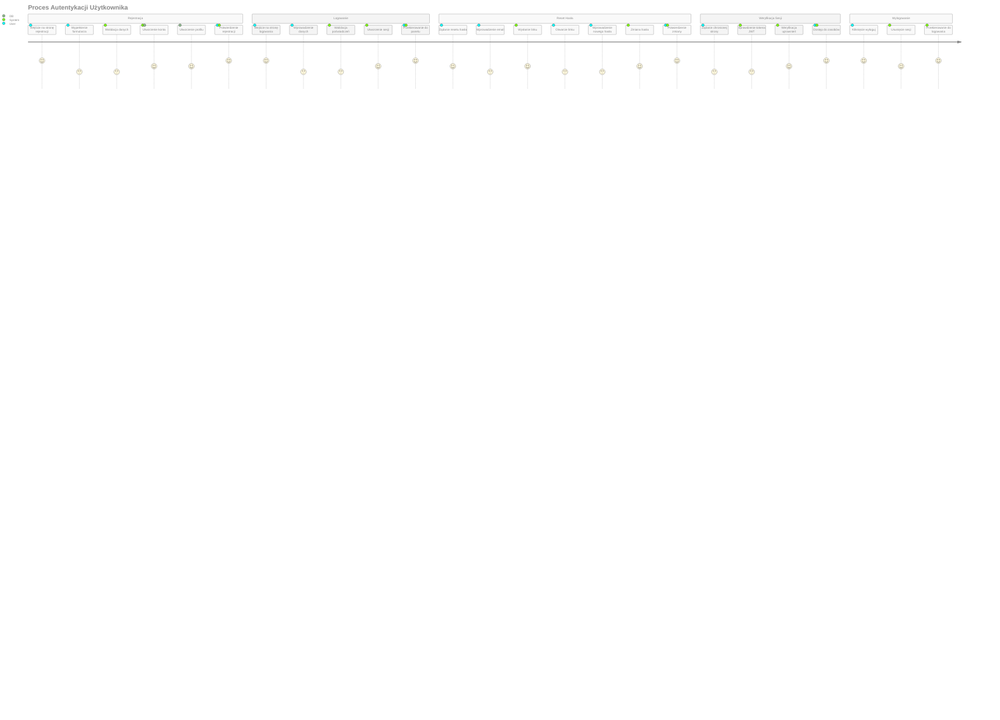

```mermaid
%%{init: {'theme': 'base', 'themeVariables': { 'primaryColor': '#f9f9f9', 'primaryTextColor': '#888', 'primaryBorderColor': '#999', 'lineColor': '#777', 'secondaryColor': '#f4f4f4', 'tertiaryColor': '#fff' }}}%%
journey
    title Proces Autentykacji Użytkownika
    
    section Rejestracja
        Wejście na stronę rejestracji: 5: User
        Wypełnienie formularza: 3: User
        Walidacja danych: 3: System
        Utworzenie konta: 4: System, DB
        Utworzenie profilu: 4: DB
        Potwierdzenie rejestracji: 5: User, System

    section Logowanie
        Wejście na stronę logowania: 5: User
        Wprowadzenie danych: 3: User
        Walidacja poświadczeń: 3: System
        Utworzenie sesji: 4: System
        Przekierowanie do panelu: 5: User, System

    section Reset Hasła
        Żądanie resetu hasła: 4: User
        Wprowadzenie email: 3: User
        Wysłanie linku: 4: System
        Otwarcie linku: 3: User
        Wprowadzenie nowego hasła: 3: User
        Zmiana hasła: 4: System
        Potwierdzenie zmiany: 5: User, System

    section Weryfikacja Sesji
        Żądanie chronionej strony: 3: User
        Sprawdzenie tokena JWT: 3: System
        Weryfikacja uprawnień: 4: System
        Dostęp do zasobów: 5: User, System

    section Wylogowanie
        Kliknięcie wyloguj: 5: User
        Usunięcie sesji: 4: System
        Przekierowanie do logowania: 5: System
``` 
