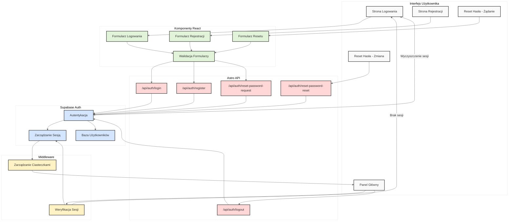

```mermaid
%%{init: {'theme': 'base', 'themeVariables': { 'primaryColor': '#f9f9f9', 'primaryTextColor': '#333', 'primaryBorderColor': '#999', 'lineColor': '#666', 'secondaryColor': '#f4f4f4', 'tertiaryColor': '#fff' }}}%%
flowchart TB
    subgraph "Interfejs Użytkownika"
        A["Strona Logowania"]
        B["Strona Rejestracji"]
        C["Reset Hasła - Żądanie"]
        D["Reset Hasła - Zmiana"]
        E["Panel Główny"]
    end

    subgraph "Komponenty React"
        F["Formularz Logowania"]
        G["Formularz Rejestracji"]
        H["Formularz Resetu"]
        I["Walidacja Formularzy"]
    end

    subgraph "Astro API"
        J["/api/auth/login"]
        K["/api/auth/register"]
        L["/api/auth/reset-password-request"]
        M["/api/auth/reset-password-reset"]
        N["/api/auth/logout"]
    end

    subgraph "Middleware"
        O["Weryfikacja Sesji"]
        P["Zarządzanie Ciasteczkami"]
    end

    subgraph "Supabase Auth"
        Q["Autentykacja"]
        R["Zarządzanie Sesją"]
        S["Baza Użytkowników"]
    end

    %% Przepływ logowania
    A --> F
    F --> I
    I --> J
    J --> Q
    Q --> R
    R --> P
    P --> E

    %% Przepływ rejestracji
    B --> G
    G --> I
    I --> K
    K --> Q
    Q --> S

    %% Przepływ resetu hasła
    C --> H
    H --> I
    I --> L
    L --> Q
    D --> M
    M --> Q

    %% Weryfikacja sesji
    E --> O
    O --> R
    O --> |"Brak sesji"| A

    %% Wylogowanie
    E --> N
    N --> Q
    Q --> |"Wyczyszczenie sesji"| A

    classDef page fill:#f9f9f9,stroke:#333,stroke-width:2px;
    classDef component fill:#e1f3d8,stroke:#333,stroke-width:2px;
    classDef api fill:#ffd7d7,stroke:#333,stroke-width:2px;
    classDef middleware fill:#fff3c6,stroke:#333,stroke-width:2px;
    classDef auth fill:#d4e5ff,stroke:#333,stroke-width:2px;

    class A,B,C,D,E page;
    class F,G,H,I component;
    class J,K,L,M,N api;
    class O,P middleware;
    class Q,R,S auth;
``` 
